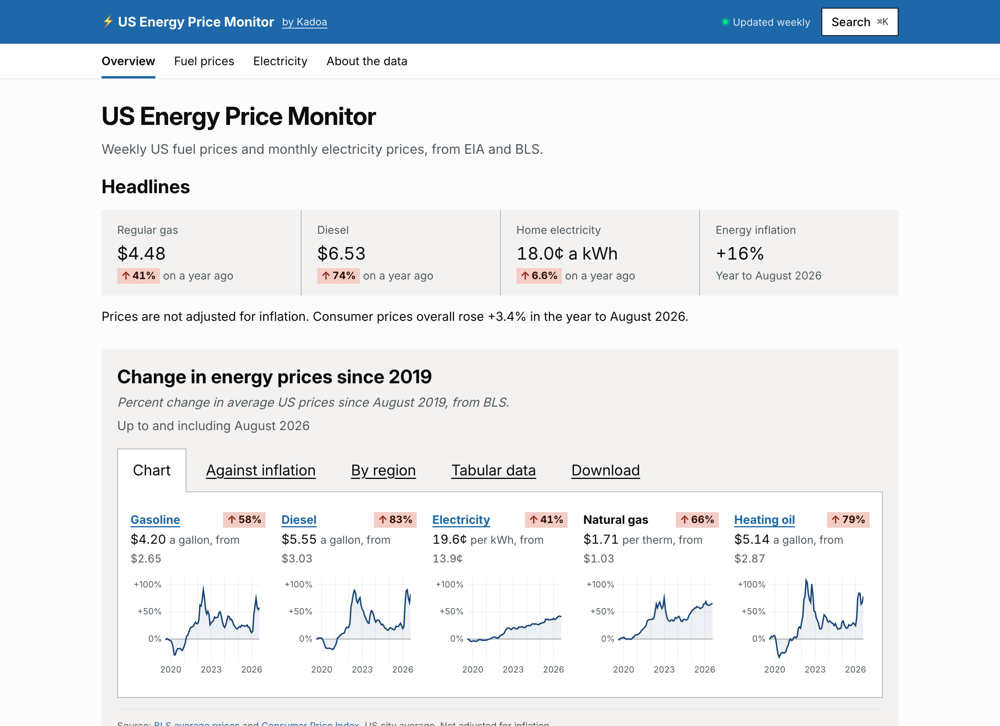

# US Energy Price Monitor

**Live: [kadoa.com/energy-prices](https://www.kadoa.com/energy-prices)**

[](https://www.kadoa.com/energy-prices)

The US government publishes what Americans pay for gasoline, diesel, heating fuel and electricity, but across separate EIA and BLS releases, in bulk files and tables that are hard to compare or follow over time. We think public data should be simple to find and read, so we built this tracker.

## What is in it

- Weekly prices for gasoline (regular, midgrade, premium), diesel, heating oil, propane and crude oil, for the US, its regions, states and cities
- Electricity price, average bill and use for every state since 2001, and for 300 utilities since 2019
- How energy prices have moved since 2019 against overall inflation
- A page for every fuel and area, state and utility, with CSV downloads and search (⌘K)

## Data

**Sources.** EIA's weekly petroleum surveys, Electric Power Monthly, Natural Gas Monthly and monthly utility survey (EIA-861M), and BLS average prices and the Consumer Price Index. All public domain.

**Pipelines.** A [Kadoa](https://www.kadoa.com) pipeline collects each release, keeps every figure in SQLite and exports the dataset. The pipeline code is not public yet.

**Integration.** The build reads the latest export and prerenders every page, about 470 of them. This repository holds the site only.

## Run it locally

```sh
bun install
bun test
ENERGY_DATASET_DIR=/path/to/pipeline bun run data   # needs the pipeline's export
bun run dev   # http://127.0.0.1:5190/energy-prices/
```

React, Vite and Chart.js. No backend.

MIT licensed. Built by [Kadoa](https://www.kadoa.com).
